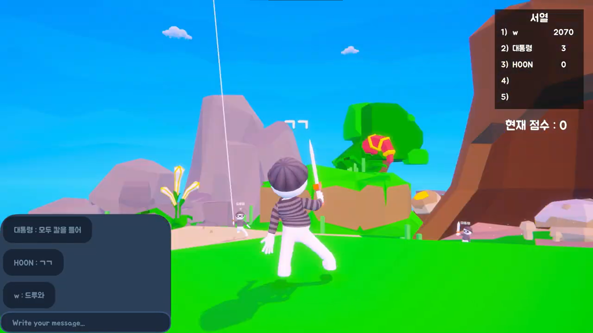

# OH MY SWORD

## 팀원 소개
|팀원|직군|작업 내용|
|:---:|:---:|:---:|
|박세훈|팀장, 프로그래머|멀티스레딩 소켓 서버 구축|
|임준성|프로그래머|플레이어 구현 및 동기화, 채팅 제작|
|김지성|프로그래머|UI 제작|

## 게임 소개
OH MY SWORD는 **io게임**과 같이 게임에 접속한 플레이어들이 함께 즐기는 게임입니다.
친구와 **짧은 시간 간단하고 유쾌하게** 즐길 수 있는 게임을 만들고자 제작하게 되었습니다.
병맛스러움을 연출하기 위해 액티브 레그돌, 점점 길어지는 검 등 게임 속에 웃을 수 있는 기믹들을 구현하여 가벼운 분위기를 가진 게임을 만들었습니다.
